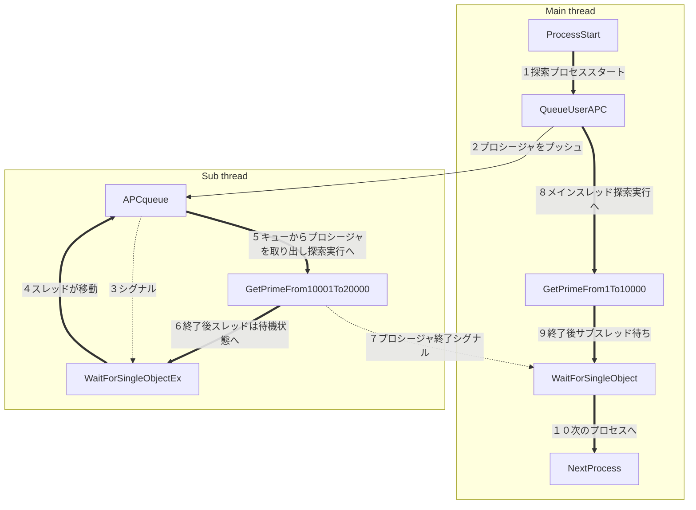

# この記事の対象読者
## ※スレッドプールの記事ではありません
## 次の様な方向け
**1\. スレッドを再利用したい方**
　スレッドを作り、実行し、閉じる。また、別のプロシージャでスレッドを作り実行し、閉じる。うーん、もっといい方法ないかなぁと思っている方。
**2\. ビジネスロジックの状態遷移をそのままプログラムで使えないかな？と、思っている方**
　ビジネスロジックによっては、ループする場合もあります。これを関数でやろうとすると、
* その関数内で作業を実行し状態を更新。その状態に応じて、別の関数をコール
* 次の関数内で作業を実行し状態を更新。その状態に応じて、別の関数をコール･･･

と、関数がネストしていきます。なんかスッキリしません。まずは、起きないでしょうが、スタックオーバーフローする可能性もあります。

**3\. 次のtickまでに各オブジェクトの状態を更新したいのだけど、スレッドが回る様にするにはどうすればいいのと、思っている方**
　アクターモデル的な物を作った場合の一つの例です。 
　オブジェクトの更新をする場合、キューを使います。各クラスの基底クラスは同じにして、更新メソッドを定義して、更新したいオブジェクトはキューに入れ、更新メソッドを呼び出す使い方です。もちろん自前で用意したキューでもいいですが、システムもスレッドにキューを持っていますで、それが、使える場合があります。

**4\.GUIのイベントプロシージャ内で、GUIの変更をしたいがうまくいかない、もうWin UI3にしようかなと思っている方**
　ちょっと凝ったGUIのイベントプロシージャ内で、イベントに応じてGUIの変更をしようとすると、うまくいかない。これは大抵イベントプロシージャがネストしてしまい、思った様に動作しない事が原因です。取り合えずプロシージャ内で現状を把握し、変更を加えるのはサブスレッドから行うようにすると、うまくいく可能性があります。

**5\. Async/Await的な事をWindowsネイティブで頻繁に行いたい**
　他のコード部分がネイティブだと、「ついでにここも」という使い方もあり。

　そんな方向けの記事です。
## 仕組みはAPCキューを使う
　これが全てです。

https://learn.microsoft.com/ja-jp/windows/win32/sync/asynchronous-procedure-calls

　上記サイトを要約すると、
* **各スレッドはAPCキューという物を持っていて、ソフトウェア割り込み的な事で、そのキューに入っているプロシージャを実行する事が出来る**

と、いう事です。
　これを利用して、予めスレッドを作っておいて待機させ、プロシージャを
[QueueUserAPC](https://learn.microsoft.com/ja-jp/windows/win32/api/processthreadsapi/nf-processthreadsapi-queueuserapc "QueueUserAPC") で、キューに追加し、スレッドで実行するようにすれば、普段スレッドは待機し、必要になれば実行に移せる仕組みを作る事ができます。


## APCとはスレッドプロシージャを変える事が可能な仕組み
[SuspendThread](https://learn.microsoft.com/ja-jp/windows/win32/api/processthreadsapi/nf-processthreadsapi-suspendthread "SuspendThread")や[ResumeThread](https://learn.microsoft.com/ja-jp/windows/win32/api/processthreadsapi/nf-processthreadsapi-resumethread "ResumeThread")と違うところは、単にスレッドを「中断」や「再開」をするのではなく、スレッドプロシージャそのものを変える事が出来る事です。
## サンプルコード
　スレッドプロシージャの切り替えを試せる簡単なサンプルコードを作ってみました。

 
### サンプルコードの事前説明
　サンプルコードは、１から40000までの素数を求め、表示するものです。メインスレッド、サブスレッドに分かれ、分割して求めています。わざとらしい関数、`GetPrimeFrom1To10000`、`GetPrimeFrom10001To20000`、`GetPrimeFrom20001To30000`、`GetPrimeFrom30001To40000`を分担して実行します。サブスレッドは**ハンドルを閉じず**に、別のプロシージャを実行しています。

#### フローチャート



### この記事のソースコードへのリンク
[GitHubへのリンクはここです。Visual Studio 2022用に設定されたslnファイルもあります。](https://github.com/NewGoldSmith/SubProcess "https://github.com/NewGoldSmith/SubProcess")
　 **TestProject**を**スタートアッププロジェクト**に設定し、ソリューションエクスプローラーから**TestPrime.cpp**を選択し、プロパティの設定で**全般->ビルドから除外**項目を**いいえ**に設定し、**TestPrime.cpp以外**は**はい**に設定し、ターゲットCPUをx64に設定し、`F5`を押下すると実行できます。

 
:::note info
 　この記事で紹介しているソースコードは、公開した時点から変更を加えている事があります。そのため、元の記事とは異なる結果を得る場合があります。また、ソースコードを機能別にディレクトリを分ける等の、改善を行う可能性があります。
:::

### コードの解説
　下記にサンプルコードを記載します。その後、番号のコメントが付けられているところの、解説を順次行います。実行結果は、各々が確認してもらえればと思います。
#### TestPrime.cpp
```TestPrime.cpp
#include <Windows.h>
#include <iostream>
#include <sstream>
#include <memory>
#include <cmath>
#include <crtdbg.h>
#include <exception>
using namespace std;
using  psh_t = pair<stringstream*, HANDLE>;// 1

bool isPrime(int num){ // 2
	if( num <= 1 )
		return false;
	if( num == 2 )
		return true;
	if( num % 2 == 0 )
		return false;
	for( int i = 3, const int sqnum = sqrt(num); i <= sqnum; i += 2 ){
		if( num % i == 0 )
			return false;
	}
	return true;
}

void GetPrimeFrom1To10000(ULONG_PTR p){ // 3
   psh_t* psh = reinterpret_cast<psh_t*>(p);
   for( int num(1); num <= 10000; ++num ){
      if( isPrime(num) ){
         *(psh->first) << num << " ";
      }
   }
	if( psh->second )
		SetEvent(psh->second); // 4
}

void GetPrimeFrom10001To20000(ULONG_PTR p){ // 5
	psh_t* psh = reinterpret_cast<psh_t*>(p);
	for( int num(10001); num <= 20000; ++num ){
		if( isPrime(num) ){
			*(psh->first) << num << " ";
		}
	}
	if( psh->second )
		SetEvent(psh->second); // 4
}

void GetPrimeFrom20001To30000(ULONG_PTR p){ // 6
	psh_t* psh = reinterpret_cast<psh_t*>(p);
	for( int num(20001); num <= 30000; ++num ){
		if( isPrime(num) ){
			*(psh->first) << num << " ";
		}
	}
	if( psh->second )
		SetEvent(psh->second); // 4
}

void GetPrimeFrom30001To40000(ULONG_PTR p){ // 7
	psh_t* psh = reinterpret_cast<psh_t*>(p);
	for( int num(30001); num <= 40000; ++num ){
		if( isPrime(num) ){
			*(psh->first) << num << " ";
		}
	}
	if( psh->second )
		SetEvent(psh->second); // 4
}

DWORD pThreadProc(LPVOID pvoid){ // 8
	HANDLE hEvent = reinterpret_cast<HANDLE>(pvoid);
	for( ;;){
		DWORD dw = ::WaitForSingleObjectEx(hEvent, INFINITE, TRUE);
		if( dw == WAIT_IO_COMPLETION ){
			OutputDebugStringA("APC executed.\r\n");
		} else if( dw == WAIT_OBJECT_0 ){
			OutputDebugStringA("Event signaled.\r\n");
			return 0;
		} else{
			cerr << "err" << endl;
			return 123;
		}
	}
}

int main(){
	{
		unique_ptr<remove_pointer_t<HANDLE>, decltype(CloseHandle)*> hEvThread{ [](){
			HANDLE h;
		if( !(h = CreateEvent(NULL, TRUE, FALSE, NULL)) ){
			throw exception("CreateEvent");
		} return h; }(),CloseHandle }; // 9

		unique_ptr<remove_pointer_t<HANDLE>, decltype(CloseHandle)*> hEvPrime{ [](){
			HANDLE h;
		if( !(h = CreateEvent(NULL, TRUE, FALSE, NULL)) ){
			throw exception("CreateEvent");
		} return h; }(),CloseHandle }; // 10

		unique_ptr<remove_pointer_t<HANDLE>, decltype(CloseHandle)*> hThread{ [&](){
		  HANDLE h;
		  if( !(h = CreateThread(NULL,0,pThreadProc,hEvThread.get(), 0, NULL)) ){
			  throw exception("CreateThread");
		  } return h; }(),CloseHandle }; //11

		stringstream ss1, ss2;
		psh_t pairss{ &ss1,NULL };
		psh_t pairssev{ &ss2,hEvPrime.get() };
		QueueUserAPC((PAPCFUNC)GetPrimeFrom10001To20000, hThread.get(), (ULONG_PTR)&pairssev); // 12
		GetPrimeFrom1To10000((ULONG_PTR)&pairss); // 13
		WaitForSingleObject(hEvPrime.get(),INFINITE); // 14

		stringstream ss3, ss4;
		pairss.first = &ss3;
		ResetEvent(hEvPrime.get()); // 15
		pairssev.first = &ss4;
		QueueUserAPC((PAPCFUNC)GetPrimeFrom30001To40000, hThread.get(), (ULONG_PTR)&pairssev); // 16
		GetPrimeFrom20001To30000((ULONG_PTR)&pairss); // 17
		WaitForSingleObject(hEvPrime.get(), INFINITE); // 18

		cout << ss1.str() << endl;
		cout << ss2.str() << endl;
		cout << ss3.str() << endl;
		cout << ss4.str() << endl;

		SetEvent(hEvThread.get()); // 19
		WaitForSingleObject(hThread.get(), INFINITE); // 20
   }
   _CrtDumpMemoryLeaks();
   return 0;
}
```

#### 1\. 
``` TestPrime.cpp
using  psh_t = pair<stringstream*, HANDLE>;// 1
```
　psh_tという別名の型を宣言。

#### 2\. 
``` TestPrime.cpp
bool isPrime(int num){ // 2
   if( num <= 1 )
      return false;
   if( num == 2 )
      return true;
   if( num % 2 == 0 )
      return false;
   for( int i = 3; i <= sqrt(num); i += 2 ){
      if( num % i == 0 )
         return false;
   }
   return true;
}
```
　引数`num`が素数か、または素数でないか判定する関数の定義。

#### 3\.4\.5\.6\.7\.
```TestPrime.cpp
void GetPrimeFrom1To10000(ULONG_PTR p){ // 3
   psh_t* psh = reinterpret_cast<psh_t*>(p);
   for( int num(1); num <= 10000; ++num ){
      if( isPrime(num) ){
         *(psh->first) << num << " ";
      }
   }
	if( psh->second )
		SetEvent(psh->second); // 4
}
```
　**３、５、６、７、** は、指定された範囲の素数を探索する関数。一つの関数にする事も出来るのですが、スレッドプロシージャの切り替えを見る為に、敢えて別々の関数にしています。
　**４、** は、その関数の中で、探索のforループが終わったら、イベントハンドルがあればシグナルにするコードです。

#### 8\.
``` TestPrime.cpp
DWORD pThreadProc(LPVOID pvoid){ // 8
	HANDLE hEvent = reinterpret_cast<HANDLE>(pvoid);
	for( ;;){
		DWORD dw = ::WaitForSingleObjectEx(hEvent, INFINITE, TRUE);
		if( dw == WAIT_IO_COMPLETION ){
			OutputDebugStringA("APC executed.\r\n");
		} else if( dw == WAIT_OBJECT_0 ){
			OutputDebugStringA("Event signaled.\r\n");
			return 0;
		} else{
			cerr << "err" << endl;
			return 123;
		}
	}
}
```

　スレッドプロシージャ。キューが空の場合、
``` TestPrime.cpp
		DWORD dw = ::WaitForSingleObjectEx(hEvent, INFINITE, TRUE);
```
のところでスレッドが待機しています。その時、メインスレッドで
``` processthreadsapi.h
DWORD QueueUserAPC(
  [in] PAPCFUNC  pfnAPC,
  [in] HANDLE    hThread,
  [in] ULONG_PTR dwData
);
```
が、呼ばれてキューにプッシュされると、スレッドが`pfnAPC`に移ります。そのpfnAPCから返って来ると、`WaitForSingleObjectEx`は戻り値`WAIT_IO_COMPLETION`を返してこの関数から抜けます。ループになっているので、再び`WaitForSingleObjectEx`でスレッドは待機します。また、待機中に`hEvent`がシグナルになると、`WAIT_OBJECT_0`を返してこの関数から抜けます。`WAIT_OBJECT_0`は、`return 0;`で、スレッドから抜けます。
#### 9\.10\.
``` TestPrime.cpp
		unique_ptr<remove_pointer_t<HANDLE>, decltype(CloseHandle)*> hEvThread{ [](){
			HANDLE h;
		if( !(h = CreateEvent(NULL, TRUE, FALSE, NULL)) ){
			throw exception("CreateEvent");
		} return h; }(),CloseHandle }; // 9

		unique_ptr<remove_pointer_t<HANDLE>, decltype(CloseHandle)*> hEvPrime{ [](){
			HANDLE h;
		if( !(h = CreateEvent(NULL, TRUE, FALSE, NULL)) ){
			throw exception("CreateEvent");
		} return h; }(),CloseHandle }; // 10
```
　イベントオブジェクトの、作成と削除を記述しています。
#### 11\.
``` TestPrime.cpp
		unique_ptr<remove_pointer_t<HANDLE>, decltype(CloseHandle)*> hThread{ [&](){
		  HANDLE h;
		  if( !(h = CreateThread(NULL,0,pThreadProc,hEvThread.get(), 0, NULL)) ){
			  throw exception("CreateThread");
		  } return h; }(),CloseHandle }; //11
```
　スレッドの作成と削除を記述しています。
#### 12\.
``` TestPrime.cpp
		QueueUserAPC((PAPCFUNC)GetPrimeFrom10001To20000, hThread.get(), (ULONG_PTR)&pairssev); // 12
```
　関数`GetPrimeFrom10001To20000`をAPCキューにプッシュします。実行するスレッドは、`hThread`のハンドルのスレッドを指定しています。
### 13\.
``` TestPrime.cpp
		GetPrimeFrom1To10000((ULONG_PTR)&pairss); // 13
```
　この本スレッドで、関数`GetPrimeFrom1To10000((ULONG_PTR)&pairss)`を実行します。
#### 14\.
``` TestPrime.cpp
		WaitForSingleObject(hEvPrime.get(),INFINITE); // 14
```
　サブスレッドが終了するのを待ちます。終了すると、`hEvPrime`がシグナルになります。
#### 15\.
``` TestPrime.cpp
		ResetEvent(hEvPrime.get()); // 15
```
　再び、`hEvPrime`をアンシグナルにし、次に備えます。
#### 16\.
```
		QueueUserAPC((PAPCFUNC)GetPrimeFrom30001To40000, hThread.get(), (ULONG_PTR)&pairssev); // 16
```
　今度は、別のプロシージャをAPCキューにセットします。
#### 17\.
``` TestPrime.cpp
		GetPrimeFrom20001To30000((ULONG_PTR)&pairss); // 17
```
　本スレッドも別のプロシージャを実行します。もちろんこの本スレッドもAPCキューを持っていますので、そのキューにプッシュする事も可能です。`SleepEx`とかでAPCキューのプロシージャを実行することが可能です。
#### 18\.
``` TestPrime.cpp
		WaitForSingleObject(hEvPrime.get(), INFINITE); // 18
```
　サブスレッドのプロシージャの終了を待ちます。
#### 19\.
``` TestPrime.cpp
		SetEvent(hEvThread.get()); // 19
```
　サブスレッドを終了させるイベントオブジェクトをシグナルにします。
#### 20\.
``` TestPrime.cpp
		WaitForSingleObject(hThread.get(), INFINITE); // 20
```
　サブスレッドが終了するのを待ちます。stdライブラリのjoinと同じ役目ですね。
### コードの説明は以上です
## まとめ
* APCキューを使えば、一つのスレッドで複数のプロシージャが使える
* Async/Await的な事も、同期オブジェクトを使えば、それっぽい事が出来る 

# 終わりに
　「**[Windows][C++]スレッドプロシージャをダイナミックに変更する**」の解説は以上となります。この記事が皆様の閃きや発想のきっかけになりましたら幸いです。
　また、ご意見、ご感想、ご質問など、お待ちしております。


